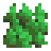
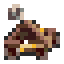

= Dice Tactics
William F. de Araújo <williampigmeu@gmail.com>
v0.3, 02-16-2020
:toc: left
:icons: font

:icon-resource: image:icons/resource.png[Resource, title="Resource", width=25]
:icon-blocked: image:icons/blocked.png[Blocked, title="Blocked", width=25]
:icon-target: 
:icon-marker: 
:icon-tank: 
:icon-squad: image:icons/squad.png[Squad, title="Squad", width=23]

:icon-spawn: 
:icon-ground: image:icons/ground.png[Ground, title="Ground", width=23]
:icon-water: 
:icon-bridge: image:icons/bridge.png[Bridge, title="Bridge", width=23]
:icon-forest: 
:icon-hill: image:icons/hill.png[Hill, title="Hill", width=23]
:icon-flag: image:icons/flag.png[Flag, title="Flag", width=23]
:icon-village: image:icons/village.jpg[Village, title="Village", width=23]
:icon-tower: image:icons/tower.png[Tower, title="Tower", width=23]
:icon-ballista: 
:icon-windmill: image:icons/windmill.png[Windmill, title="Windmill", width=23]

:icon-spawn-big: 
:icon-ground-big: image:icons/ground.png[Ground, title="Ground", width=42]
:icon-water-big: 
:icon-blocked-big: image:icons/blocked.png[Blocked, title="Blocked", width=42]
:icon-bridge-big: image:icons/bridge.png[Bridge, title="Bridge", width=42]
:icon-forest-big: 
:icon-hill-big: image:icons/hill.png[Hill, title="Hill", width=42]
:icon-flag-big: image:icons/flag.png[Flag, title="Flag", width=42]
:icon-village-big: image:icons/village.jpg[Village, title="Village", width=42]
:icon-tower-big: image:icons/tower.png[Tower, title="Tower", width=42]
:icon-ballista-big: 
:icon-windmill-big: image:icons/windmill.png[Windmill, title="Windmill", width=42]

++++

++++

== Setting Up the Battlefield
Before you can start fighting for control, you need to prepare the game board:

. Set the {icon-target} *Target* to 2.
. Place the {icon-marker} *Operation Marker* on the Target Zone's {icon-flag} *Flag*.
. Add 2 {icon-tank} *Tanks* to each Player's Supply.
. Give each player 4 {icon-squad} *Squads* and 3 {icon-resource} *Resources*.
. Flip a coin to determine the *first* player.
. Starting with the *second* player, each player chooses a side, then places all of their {icon-squad} *Squads* on that side's {icon-spawn} *Spawn Points*.
. Deal 4 Action Cards to each player. Each player keeps one and hands the rest to the other. Repeat until each player has picked 2 cards. Those form their hands. The rest of the cards go back into the Action Deck and it is shuffled.
. The *first* player can now take their turn!

WARNING: At the start of the game, only the bottom {icon-spawn} *Spawn Points* are available.

== Units
Each Unit is represented by a six-sided die. The value shown on top of them represents their current strength.

Unit Types::
    {icon-squad} Squad:::
        The most basic of Units, a squad of armed soldiers.
        
        Stats::::
        - Strength: 1 to 6
        - Range: 2
        
    {icon-tank} Tank:::
        Equipped with highly advanced tech, the Tank is a strong combat unit.
        
        Stats::::
        - Strength: 2 to 6
        - Range: 3
        
        Machinery::::
            If at any moment this Unit's strength reaches 2, it is destroyed. +
            Permanently remove it from the game and replace it with a {icon-squad} Squad with 1 strength. +
            Any remaining losses are discarded.
            
        Fullmetal::::
            If the defender is defeated, skip the _counter-attack_ phase.
        
        Motorized::::
            No more than once, after moving during a _March_, it may do 1 free movement.

== Player Turns 
During their turn, a player can take up to 2 actions. The same action may be taken more than once.

Player Actions::
    March:::
        Take up to 3 movements with any of your Units.
        
    Attack:::
        Choose a *Unit* to attack with (the "attacker") and an enemy target *Unit* that's within range (the "defender"). +
        The player that's attacking does as follows, in order:
        . The defender takes losses equal to the attackers strength + 1, minus their strength. __(On a tie, the defender takes 1 loss.)__
        . The defender does a _counter-attack_.
        . Once an involved *Unit*'s strength reaches 0, they are defeated.
        . If the attacker was defeated, the opponent gains 1 VP. Move the Unit to any {icon-spawn} *Spawn Point* that's not adjacent to the Target Zone, they regain 2 strength.
        . If the defender was defeated:
            .. Move the defender to any {icon-spawn} *Spawn Point* that's not adjacent to the Target Zone, they regain 2 strength.
            .. Choose one of the following:
                ... Eliminate: Gain 2 VP.
                ... Research: Gain 1 VP and 1 {icon-resource} *Resource*.
        . Otherwise, if the defender is in a Village, Tower or Ballista, move it to any adjacent space.

NOTE: Adjacent spaces are orthogonal: Up, down, left and right. +
      Diagonal spaces are non-adjacent.

Action Cards::
    At the start of their turn, a player may play a single *Action Card* from their hand, this does not count as an action. +
    The player can also ignore the card's effect to gain 1 {icon-resource} *Resource* until the end of their turn. +
    Once it's been played, the card goes back to the *Action Card* deck, and it is shuffled. +

    Emergency Upgrade:::
        Pay 1 {icon-resource} *Resource*. +
        _Upgrade_ one of your Units into a 4 strength {icon-tank} *Tank*. +
        __(You can do this even if you have no {icon-tank} *Tanks* on your supply.)__

    Forward!:::
        Do a _March_ action, but you cannot move the same Unit more than once. +
        __({icon-tank} *Tanks* do not get any free movement).__

    Sabotage:::
        Pay 1 {icon-resource} *Resource*. +
        Move a single movement with an enemy Unit. +
        {empty} +
        _- OR -_ +
        {empty} +
        Pay 2 {icon-resource} *Resources*. +
        Make up to 3 movements with a single enemy Unit.

    Exhaustion:::
        During the opponent's next turn, they take -1 movement on their _March_ action.

    Fuel Shortage:::
        Pay 1 {icon-resource} *Resource*. +
        During their next turn, the opponent cannot move any {icon-tank} *Tanks* with their _March_ action.

    Bullseye:::
        On your next _Attack_ action during this turn, the defender takes +1 loss.

    Supply and Demand:::
        During your opponent's next turn, _Upgrading_ costs +1 {icon-resource} *Resource*.

    Bribe:::
        Pay 1 {icon-resource} *Resource*. +
        The {icon-marker} *Contest Marker* advances or goes back one space.
        
    Navigation Expert:::
        During your next _March_ action this turn, ignore extra movement costs.
    
    Take Cover!:::
        Pay 1 {icon-resource} *Resource*. +
        During the opponent's next turn, defending Units have +1 strength. +
        __(A Unit can never have more than 6 strength.)__

== The Battlefield
Units move through the Battlefield to fight, gain resources and contest flags.

Terrain Types::
    {icon-ground-big} Ground:::
        The default terrain type. +
        Has no special effects.
        
    {icon-spawn-big} Spawn Point:::
        Has no special effects.
    
    {icon-water-big} Water:::
        Costs an additional movement to leave. +
        While standing in Water, a Unit cannot _counter-attack_ and has -1 strength when defending. +
        {icon-tank} *Tanks* cannot move into Water.
        
    {icon-bridge-big} Bridge:::
        To enter a Bridge costs an additional movement for {icon-tank} *Tanks*. +
        _(Their free movement can be used for that.)_
    
    {icon-forest-big} Forest:::
        While standing in a Forest, a Unit cannot suffer a _counter-attack_ and has +1 strength when defending. +
        {icon-tank} *Tanks* cannot move into a Forest.
        
    {icon-hill-big} Hill:::
        Costs an additional movement to enter. +
        While standing a Hill, a Unit has +2 range (unless it is a {icon-tank} *Tank*) and cannot suffer a _counter-attack_.
    
    {icon-flag-big} Flag:::
        Entering a Flag space in the Target Zone starts a *Contest*.
    
    {icon-blocked-big} Contested:::
        No movement can be done on a Contested space.
        
    {icon-village-big} Village:::
        At the end of your turn, a Unit that's standing in a Village may take one of the following actions:
        
        Rest::::
            The Unit regains 2 strength, up to a maximum of 4.
        
        Hire::::
            Pay up to 2 {icon-resource} *Resources* to hire mercenaries. +
            The Unit gains +1 strength per {icon-resource} *Resource* spent, up to a maximum of 6.
            
        Prep::::
            Draw an Action Card, then discard your hand down to 2.
    
    {icon-tower-big} Tower:::
        While standing in a Tower, a Unit has +1 range (unless it is a {icon-tank} *Tank*). +
        At the end of your turn, a Unit that's standing in a Tower may take one of the following actions:
        
        Upgrade::::
            Pay 2 {icon-resource} *Resources* to upgrade any of your {icon-squad} *Squads* into a {icon-tank} *Tank*. +
            The strength of the {icon-tank} *Tank* is equal to the old {icon-squad} *Squad*'s strength + 2. +
            The old {icon-squad} *Squad* goes into the player's supply if possible. +
            _(A Unit that's standing in a Village cannot be upgraded.)_
        
        Relocate::::
            Make up to 2 movements with a single Unit. +
            _({icon-tank} *Tanks* don't get a free movement.)_

    {icon-ballista-big} Ballista:::
        At the start of your turn, a Unit that's standing in a Ballista may take the following action:
        
        Shoot::::
            Pay 1 {icon-resource} *Resource* to attack an enemy Unit within 5 spaces of the Ballista. +
            The enemy Unit takes 3 losses and *cannot* _counter-attack_.
    
    {icon-windmill-big} Windmill:::
        A Unit cannot finish their movement on a Windmill if there are any {icon-resource} *Resources* on it. +
        At the end of your turn, if there is at least one Unit adjacent to a Windmill, take one {icon-resource} *Resource* from it.
    
WARNING: You cannot _Upgrade_ if you don't have any {icon-tank} *Tanks* in your supply.

NOTE: To "enter" or "leave" a space, means to go from one terrain type to another. +
      Moving from one Water tile to another, for example, costs no additional movement.
      
NOTE: Terrain actions are always free. +
      They do not count towards the 2 actions per turn.

== Contests
Whenever a Unit enters a {icon-flag} *Flag* space in the Target Zone, a Contest is started:

. The player who started the Contest gains 1 VP.
. Take the {icon-marker} *Contest Marker* and place it on the green spot of the Contest Tracker.
. At the end of every second turn, the {icon-marker} *Contest Marker* advances 1 space on the Contest Tracker.

Once the {icon-marker} *Contest Marker* reaches the red spot of the Contest Tracker, the Contest is finished:

. The player who controls the most Units inside the Target Zone gains 3 VPs.
. Place a {icon-blocked} *Contested* cube on the Target Zone's {icon-flag} *Flag*.
    .. If there's a Unit standing in the {icon-flag} *Flag* space, its owner moves it to an adjacent space.
. Roll the {icon-target} *Target* die to determine the new Target Zone.
. Place the {icon-marker} *Contest Marker* on the new Target Zone's {icon-flag} *Flag*.

WARNING: A zone containing a {icon-blocked} *Contested* cube cannot be a Target Zone.

NOTE: A "zone" is a 5x5 area represented by a striped outline around a {icon-flag} *Flag* space.

== Ending a Game
The game ends once:

. All six {icon-flag} *Flags* have been contested.
. A player has reached 10 VPs.

**The player with the most VPs is the winner!** +

In a tie, consider the following tie breakers, in order:

. Amount of {icon-resource} *Resources*
. Total Unit strength
